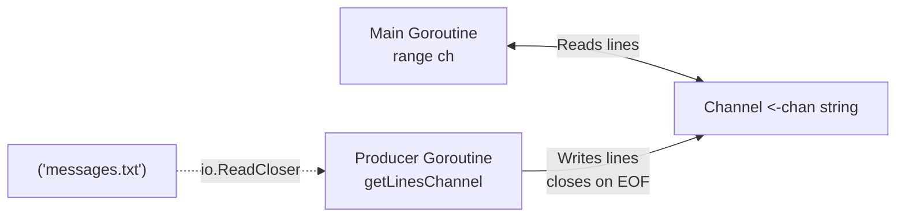

## Channel-Based File Line Reading

> [!summary] Key Takeaways
> **Core Insight:** Encapsulate blocking I/O in a goroutine streaming lines via a **receive-only channel** (`<-chan string`), enabling clean `range` consumption in the caller while handling buffering, partial reads, and resource cleanup internally.

### Implementation Pattern

```go
func getLinesChannel(f io.ReadCloser) <-chan string {
	ch := make(chan string)

	go func() {
		defer f.Close()   // Guarantees file closure
		defer close(ch)   // Signals completion to consumer

		buf := make([]byte, 8) // Small buffer to demonstrate chunking
		line := ""

		for {
			n, err := f.Read(buf)
			if err != nil && err != io.EOF {
				panic(err)
			}

			if n > 0 {
				parts := strings.Split(string(buf[:n]), "\n")

				// Send complete lines (all but last fragment)
				for i := 0; i < len(parts)-1; i++ {
					ch <- line + parts[i]
					line = ""
				}

				// Accumulate partial line (last fragment)
				line += parts[len(parts)-1]
			}

			if err == io.EOF {
				break
			}
		}

		// Flush remaining partial line
		if line != "" {
			ch <- line
		}
	}()

	return ch
}
```

### Mechanics

- **Receive-Only Channel**: Return type `<-chan string` prevents caller from closing/writing; ownership stays with producer goroutine.
- **Double Defer**: `defer f.Close()` + `defer close(ch)` ensures resources released and consumer unblocked even on panic.
- **Chunk Buffering**: Reads fixed 8-byte chunks; `strings.Split` handles newlines crossing buffer boundaries.
- **Line Assembly**: `line` variable stitches fragments split across reads.
- **Consumer Loop**: `for s := range ch` blocks until `close(ch)`, draining lines sequentially.

### Concurrency Flow



### Design Trade-offs

| Aspect | Benefit | Cost |
| :--- | :--- | :--- |
| **Decoupling** | Consumer logic independent of I/O buffering | Extra goroutine + channel allocation |
| **Backpressure** | Channel blocks producer if consumer slow | Potential deadlock if consumer stops early |
| **Error Handling** | Panics inside goroutine (simplistic) | Errors not propagated to caller via channel |

### Related Concepts
- [[Channels]] for directionality and closure semantics
- [[Error Handling]] for panic vs. error return strategies
- [[OS]] `io.ReadCloser` interface usage
