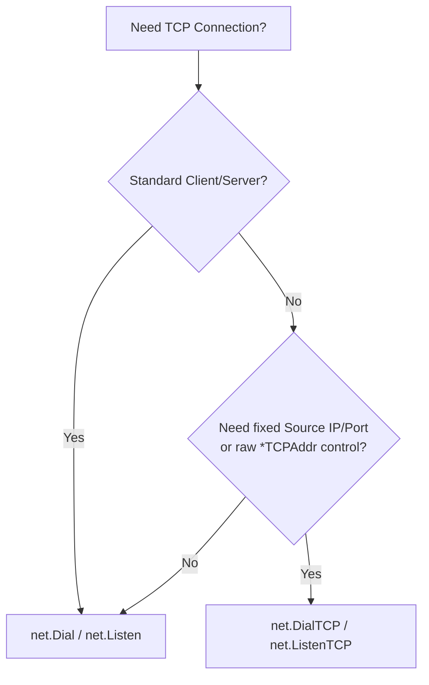

> [!example] Visual Architecture Diagram
> **Excalidraw Overview:** [[Excalidrawings/HTTP Protocol/TCP vs UDP/TCP.excalidraw|TCP Architecture]]

## TCP Setup & Patterns

> [!summary] Key Takeaway
> **Client/Server Pairing:** Use `net.Dial` (client) with `net.Listen` (server) for standard apps; drop to `net.DialTCP` only when you need explicit control over local/remote `*net.TCPAddr` (e.g., binding specific source ports/IPs).

### Core Functions

| Role | Function | Signature | Primary Use Case |
|------|----------|-----------|------------------|
| **Client** | `net.Dial` | `Dial(network, address string)` | **Default choice.** High-level TCP handshake; `network` = `"tcp"`, `"tcp4"`, `"tcp6"`. |
| **Server** | `net.Listen` | `Listen(network, address string)` | **Standard listener.** Binds to `":port"` or `"host:port"`. Returns `net.Listener`. |
| **Low-level Client** | `net.DialTCP` | `DialTCP(network, laddr, raddr *net.TCPAddr)` | **Explicit address control.** Requires `*net.TCPAddr` for both local (`laddr`) and remote (`raddr`). Mirrors `DialUDP` pattern. |

### When to Use Which

- **`net.Dial` + `net.Listen`** (99% of cases)
    - **Used together:** `Dial` connects to the `Listener`'s address.
    - **Why:** Automatic DNS resolution, happy eyeballs (IPv4/IPv6 fallback), OS-managed ephemeral ports.
- **`net.DialTCP` + `net.Listen`**
    - **Used together:** `DialTCP` connects to a standard `Listener`.
    - **When:** You must bind the **client** to a specific source IP/port (`laddr`)—e.g., multi-homed hosts, firewall rules requiring fixed source ports, or testing.
- **`net.DialTCP` + `net.ListenTCP`** (Symmetrical Low-level)
    - **Used together:** Both sides use `*net.TCPAddr`.
    - **When:** Building custom proxy/load-balancer logic where both ends need explicit address awareness before handshake.

### Quick Decision

