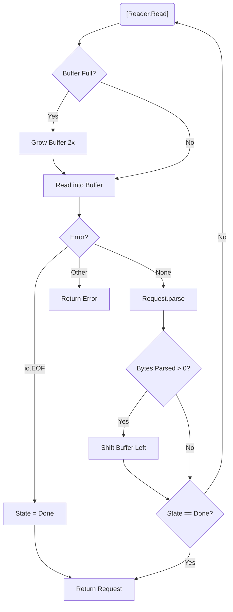
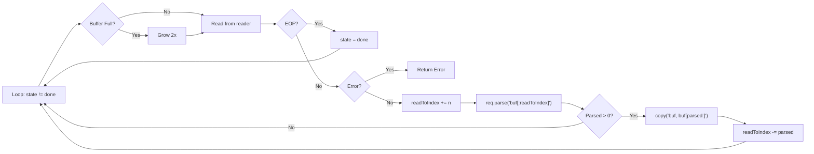

> [!summary] Key Takeaways
> **Core Insight:** TCP delivers bytes in arbitrary chunks, not complete messages—your parser must maintain state and buffer data until it finds the `\r\n` delimiter signaling a complete request line.

## The Streaming Problem

- **TCP is a stream, not packets**: You might receive `GE` then `T /coffee HTTP/1.1\r\n...` across multiple `Read` calls.
- **Parser must be stateful**: Track where you are (reading method, path, version) and resume when more bytes arrive.
- **Delimiter-driven**: The request line ends at `\r\n` (CRLF). If not found, you need more data.

## Architecture Overview



## Core Types & State Machine

### Parser States

```go
type parserState int

const (
    stateInitialized parserState = iota // 0: Waiting for request line
    stateDone                           // 1: Request line parsed
)
```

### Request Struct

```go
type Request struct {
    RequestLine RequestLine // Parsed result
    state       parserState // Internal parser state
}

type RequestLine struct {
    Method        string // GET, POST, etc.
    RequestTarget string // /path?query
    HttpVersion   string // "1.1"
}
```

- **Only two states needed** for request-line parsing: `initialized` → `done`.
- **Zero allocation** for state tracking (single `int`).

## Parsing Logic

### `parseRequestLine` — Pure Function

```go
func parseRequestLine(s string) (RequestLine, int, error)
```

| Input | Behavior |
|-------|----------|
| No `\r\n` found | Returns `(zero, 0, nil)` — **needs more data** |
| Malformed (not 3 parts) | Returns error |
| Method not uppercase | Returns error |
| Version not `HTTP/1.1` | Returns error |
| Valid | Returns `(RequestLine, bytesConsumed, nil)` |

**Bytes consumed = index of `\r\n` + 2** (includes the CRLF).

### `Request.parse` — State Machine Driver

```go
func (r *Request) parse(data []byte) (int, error)
```

| Current State | Action |
|---------------|--------|
| `initialized` | Call `parseRequestLine(string(data))` |
| &nbsp;&nbsp;• Error | Return error |
| &nbsp;&nbsp;• 0 bytes, no error | Return `(0, nil)` — need more |
| &nbsp;&nbsp;• >0 bytes | Save `RequestLine`, set `state = done`, return bytes |
| `done` | Return error: `"trying to read data in a done state"` |
| Unknown | Return error: `"unknown state"` |

> **Key insight**: Returning `(0, nil)` is the **"feed me more"** signal—not an error.

## `RequestFromReader` — The Orchestrator

```go
func RequestFromReader(reader io.Reader) (*Request, error)
```

### Buffer Management Strategy

```go
const bufferSize = 8 // Tiny to stress-test chunk handling

buf := make([]byte, bufferSize)
readToIndex := 0            // Valid data: buf[0:readToIndex]
req := &Request{state: stateInitialized}
```

### Main Loop



### Critical Buffer Operations

```go
// 1. Grow when full
if readToIndex == len(buf) {
    newBuf := make([]byte, len(buf)*2)
    copy(newBuf, buf)
    buf = newBuf
}

// 2. Read INTO buffer at current end
n, err := reader.Read(buf[readToIndex:])

// 3. Parse ONLY valid data
bytesParsed, err := req.parse(buf[:readToIndex])

// 4. Shift unparsed data to front (O(n) but buffer stays small)
if bytesParsed > 0 {
    copy(buf, buf[bytesParsed:readToIndex])
    readToIndex -= bytesParsed
}
```

- **Why shift?** Prevents unbounded buffer growth; keeps only unparsed tail.
- **Why `readToIndex`?** Tracks logical length vs. slice capacity.

## Testing with `chunkReader`

Simulates network fragmentation by returning `numBytesPerRead` bytes per `Read` call.

```go
// Test with 1 byte at a time (worst case)
reader := &chunkReader{
    data: "GET /coffee HTTP/1.1\r\nHost: localhost:42069\r\n\r\n",
    numBytesPerRead: 1,
}
r, _ := RequestFromReader(reader)
// r.RequestLine.Method == "GET"
// r.RequestLine.RequestTarget == "/coffee"
```

**Must pass** for `numBytesPerRead = 1` through `len(data)`.

## Common Pitfalls (Dummy Checklist)

| Mistake | Symptom | Fix |
|---------|---------|-----|
| Forgetting `+2` for `\r\n` | Infinite loop / off-by-one | `nextLine + 2` |
| Not shifting buffer | Memory leak, stale data | `copy(buf, buf[parsed:])` |
| Not decrementing `readToIndex` | Parser re-reads old data | `readToIndex -= parsed` |
| Treating `(0, nil)` as error | Premature failure | Loop continues, reads more |
| Calling `parse` after `done` | `"trying to read data in a done state"` | Break loop on `stateDone` |

## File Structure

```
request/
├── request.go        # Request, RequestLine, parserState, RequestFromReader, parse
├── request_test.go   # chunkReader + table-driven tests
```

## Next Steps

- Extend state machine for **headers** (`stateHeaders`, `stateBody`).
- Add **timeout** context to `RequestFromReader`.
- Handle **pipelined requests** (multiple requests on one connection).