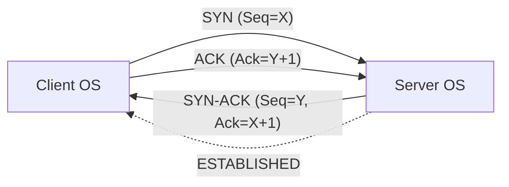
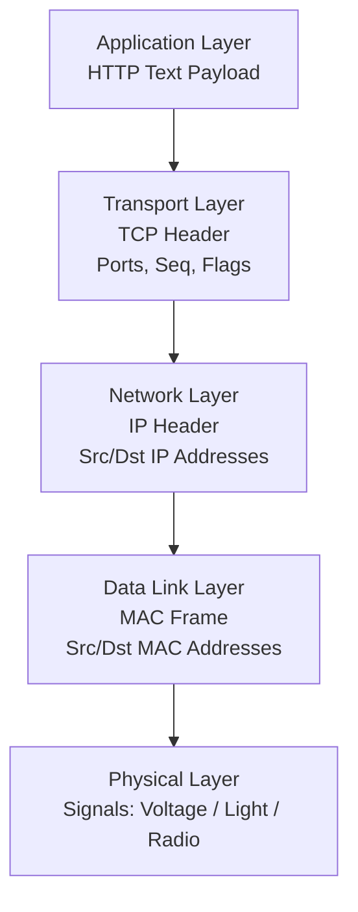

> [!example] Visual Architecture Diagram
> **Excalidraw Overview:** [[Excalidrawings/Theoretical/OS Networking (TCP, UDP) and HTTP.excalidraw|OS Networking (TCP, UDP) and HTTP Architecture]]

> [!summary] Key Takeaways
> **Core Insight:** HTTP provides semantic structure (routing, intent, context) over TCP's reliable byte stream, while encapsulation wraps payloads in headers (TCP→IP→Frame) for transit; UDP strips reliability for speed, enabling HTTP/3 (QUIC) to solve Head-of-Line Blocking via user-space streams.

---

## Core Concepts: Protocol vs Technology

- **Protocol (Convention):** Written rulebook (RFC specification). Defines *format* and *behavior*. Consumes zero resources. Examples: [[TCP]], [[HTTP_1.1 Fundamentals]], IP, UDP.
- **Technology (Implementation):** Running software/hardware executing the rules. Consumes CPU/RAM. Examples: Linux Kernel (TCP stack), Nginx/Go `net/http` (HTTP server), NIC hardware (Frames).
- **Mapping:**
  - **TCP Protocol** → Rules for packets, ACKs, sequence numbers.
  - **TCP Technology** → OS Kernel network stack (manages sockets, retransmits).
  - **HTTP Protocol** → Rules for `GET`, Headers, `\r\n\r\n`.
  - **HTTP Technology** → Your Go server parsing raw text from the OS socket.

## HTTP Mechanics

### Transfer-Encoding: Chunked
- **Purpose:** Stream dynamic data when `Content-Length` is unknown (real-time feeds, DB cursors, SSE).
- **Scope:** **Hop-by-hop** header. Each proxy/node can re-encode. Use `Content-Encoding` for end-to-end compression.
- **Protocol:** Strictly **HTTP/1.1**. Removed in HTTP/2 & HTTP/3 (handled by binary framing layers).

### Range Requests & Resumable Downloads
- **Mechanism:** Client sends `Range: bytes=1288490188-` (offset).
- **Server Response:** `206 Partial Content` + `Content-Range`.
- **Safety:** `If-Range` header (ETag/Last-Modified) prevents resuming a changed file.
- **Connections:**
  - Standard: Single TCP connection.
  - Parallel: Multiple TCP connections + `Range` headers (download managers).
  - Resume: New TCP connection + `Range` header.

### What HTTP Adds to TCP
| TCP (Transport) | HTTP (Application) |
| :--- | :--- |
| Reliable, ordered byte stream | **Routing** (`/api/users`) |
| No semantic meaning | **Intent** (`GET`, `POST`, `DELETE`) |
| No structure | **Context** (`Content-Type`, `Auth`, `Content-Length`) |
| No application feedback | **Outcomes** (`200`, `404`, `500`) |

> **Key Realization:** When your `net.Listen` TCP socket receives an HTTP request, the **client** (curl/browser) formatted the raw text. TCP just delivered the bytes. Your server code must parse `\r\n\r\n` to find the body.

## TCP Mechanics

### 3-Way Handshake (Connection Establishment)


- **Responsibility:** OS Kernel (not your app).
- **Trigger:** App calls `listen()` / `connect()` → Syscall → Kernel drives handshake.
- **State Machine (Kernel):**
  - `LISTEN` → Receive `SYN` → Send `SYN-ACK` → State `SYN_RECV`
  - `SYN_RECV` → Receive `ACK` → State `ESTABLISHED` → Wake user app (`accept()` returns).

### Connection Preservation (The Illusion)
- **No physical pipe.** Connection = **State Table Entries** in *both* OS Kernels (IP + Port + Seq Num).
- **Keep-Alive:** Empty probes sent during idle to detect dead peers.
- **Crash Scenario:** Power loss wipes Kernel RAM → State gone → Rebooted server sends `RST` on next packet → Client retransmits until timeout.

### TCP Header Anatomy (20 Bytes Minimum)
| Bytes | Field | Purpose |
| :--- | :--- | :--- |
| 0-1 | **Source Port** | Demux: Which sending app? |
| 2-3 | **Destination Port** | Demux: Which receiving app? (80/443) |
| 4-7 | **Sequence Number** | Byte ordering for reassembly. |
| 8-11 | **Acknowledgment Number** | "Received up to here." |
| 12 | **Data Offset** | Header length (where payload starts). |
| 13 | **Control Flags** | **SYN, ACK, FIN, RST, PSH, URG, ECE, CWR** (1 bit each). |
| 14-15 | **Window Size** | Flow Control: Receiver buffer capacity. |
| 16-17 | **Checksum** | Corruption detection (Layer 1/2 errors). |
| 18-19 | **Urgent Pointer** | Priority data offset (Obsolete). |

### Raw Flag Values (Byte 13)
| Packet Type | Binary (Flags Byte) | Hex |
| :--- | :--- | :--- |
| **SYN** | `00000010` | `0x02` |
| **SYN-ACK** | `01000010` | `0x12` |
| **ACK** | `01000000` | `0x10` |
| **RST** | `00000100` | `0x04` |
| **FIN** | `00000001` | `0x01` |

## Encapsulation & The Network Stack (The Journey Out)



### Layer Significance & Hop Behavior
| Layer | Header | Scope | Significance |
| :--- | :--- | :--- | :--- |
| **L4 Transport** | TCP / UDP | **End-to-End** | Ports (App targeting), Reliability (Seq/ACK), Flow Control. |
| **L3 Network** | IP | **End-to-End** | Global Routing (Source/Dest IP). Untouched by routers. |
| **L2 Data Link** | Frame (Ethernet/WiFi) | **Hop-by-Hop** | Local delivery (MAC addresses). **Destroyed & Rebuilt at every router.** |
| **L1 Physical** | Signals | **Hop-by-Hop** | Physical transmission (Copper/Fiber/Radio). |

> **Frame Swap:** Router receives Frame → Strips Frame → Reads IP → Routes → Builds **New Frame** for next hop (e.g., WiFi → Fiber) → Forwards. IP Packet & TCP Payload remain intact.

## UDP & HTTP/3 (QUIC)

### UDP Header (8 Bytes Fixed)
- **Fields:** Src Port, Dst Port, Length, Checksum.
- **No:** Handshake, Sequence Numbers, ACKs, Flow Control, State.
- **Analogy:** "Shouting across a room." Fire and forget.

### Why HTTP/3 Uses UDP (QUIC)
| TCP Problem | QUIC Solution (on UDP) |
| :--- | :--- |
| **Head-of-Line Blocking:** One lost packet blocks *all* streams (HTML, JS, CSS). | **Independent Streams:** Lost packet blocks only *that* stream. Others proceed. |
| **Handshake Latency:** TCP 3WHS (1-RTT) + TLS 1.2/1.3 (1-2 RTT) = 2-3 RTT before data. | **Combined Handshake:** QUIC + TLS 1.3 = **1 RTT** (0-RTT on resume). |
| **Ossification:** Middleboxes (firewalls/routers) hardcode TCP behavior; hard to evolve. | **User-Space:** Logic in Browser/Server binary. Update app, not OS/Kernel/Hardware. |

> **Insight:** HTTP/3 doesn't abandon reliability; it moves it from Kernel (TCP) to User-Space (QUIC) for multiplexing flexibility.

## Raw Packet Analysis Examples

### Raw HTTP Request (Payload)
```text
GET / HTTP/1.1\r\n
Host: example.com\r\n
\r\n
```
- Human-readable ASCII. `\r\n` delimits headers. Double `\r\n` signals body start.

### Raw TCP SYN Packet (Hex Dump)
```text
45 00 00 3c 1c 46 40 00 40 06 b1 e6 c0 a8 00 68  <-- IP Header
a1 61 00 50 00 00 00 00 00 00 00 00 50 02 20 00  <-- TCP Header
```
- Offset `13` (0-indexed) = `02` → Binary `00000010` → **SYN Flag Set**.

## Implementation Perspective: Kernel vs User Space

### Standard Path (Go `net.Listen`)
```go
// User Space
ln, _ := net.Listen("tcp", ":8080") // Syscall: socket(), bind(), listen()
conn, _ := ln.Accept()              // Syscall: accept() -> Blocks until Kernel state=ESTABLISHED
// Kernel handled SYN, SYN-ACK, ACK transparently.
// 'conn' is a file descriptor reading HTTP text.
```

### Raw Socket Path (Bypass Kernel TCP Stack)
```go
// Requires Root / CAP_NET_RAW
fd, _ := syscall.Socket(syscall.AF_INET, syscall.SOCK_RAW, syscall.IPPROTO_TCP)
// fd now receives RAW IP packets containing TCP headers.
// YOU must parse Byte 13 for flags, manage Seq/Ack, send SYN-ACK manually.
// YOU implement the State Machine (LISTEN -> SYN_RECV -> ESTABLISHED).
```

### Kernel TCP Logic (Conceptual C)
```c
// Inside Linux Kernel (net/ipv4/tcp_input.c simplified)
switch (sk->sk_state) {
    case TCP_LISTEN:
        if (th->syn) {
            tcp_send_synack(sk);      // Kernel builds & sends SYN-ACK
            tcp_set_state(sk, TCP_SYN_RECV);
        }
        break;
    case TCP_SYN_RECV:
        if (th->ack) {
            tcp_set_state(sk, TCP_ESTABLISHED); // Wake user process
        }
        break;
}
```

---

## Related Vault Notes
- [[TCP]] / [[TCP vs UDP]] / [[TCP Assignment]]
- [[HTTP_1.1 Fundamentals]] / [[HTTP Server Implementation Guide]]
- [[UDP Assignment]]
- [[OS]] / [[Go Starter]]
- [[RFCs]]